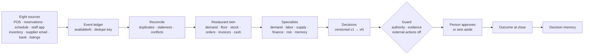

# Savy Live Ops

**A living simulation of one restaurant night.**

An independent product exploration for OPSAVOR. Synthetic data only. No real restaurant or OPSAVOR
system is connected, and nothing here describes OPSAVOR's private implementation.

## The idea

Friday, 5:12 PM. Tonight looks like the plan. In the next half hour, reservations jump to 164, a server
calls out, the burrata count comes in low, a produce invoice arrives 12% over contract, and a concert
nearby lists an end time. Labor still looks green. Eight systems each learn part of it. None learn all of it.

The owner presses **Run Savy** and watches every event travel the same path:

```
event → OBSERVE → RECONCILE → UNDERSTAND → PLAN → GUARD → owner        (LEARN waits for the outcome)
```

Then: *Tonight changed. I found 2 decisions, 1 missing fact and 2 things that can wait.*

The owner stops being the integration layer, without giving up being the owner.

## How it works

One event model, one reducer, one restaurant twin. Every screen is a projection of it. Approve the
on-call server and the floor, wages, labor, cash, the decision, the audit log and the receipt all move,
because they read the same state.



| Mode | What it shows |
|---|---|
| **Live** | Daily Pulse, attention budget, incoming ledger, the six engines, the decision queue, the floor, five operating surfaces |
| **Try it** | Three nights on the same engine, and *fork this night*: change one assumption, see which decisions move |
| **Lab** | Six faults on the live night, all 192 fault combinations, and a 30-service replay with the future locked out |
| **Memory** | Patterns from outcomes, co-created by the owner, flagged once three nights contradict them |
| **Future** | *Savy Tomorrow*, marked as exploration: from dashboard to supervised agent |
| **Ask** | Savy answering from the same twin through tools, with the pipeline each question travels |
| **Engineering view** | A clickable map of the runtime. Every block opens the live data behind it |

**Present** in the top bar plays the whole story through the real product, with captions.

## What to look at

**As an owner**

- **The Decision Room.** What changed, why it matters, what Savy recommends, what it doesn't know, what would
  change its mind, who decides, and what happens if nobody does.
- **"What if I do nothing?"** The night runs forward twice on the same twin. No change: the patio has no
  server, Priya and Dee carry 21.9 covers an hour, tickets reach 18 minutes. Savy's plan: Sam takes the patio
  and everyone holds at 14.6. The decision card, the forward run and the floor all compute the peak the same way.
- **Ask the manager.** When the missing fact is on a shelf, Savy asks for one number. The answer closes the
  decision and tomorrow's order drops from 15 burrata to 12.
- **Lineup card and Monday briefing.** The pre-shift huddle, drafted from what was decided. Everything that
  could wait lands in Monday's briefing at close.

**As an engineer**

| Fault | What Savy does |
|---|---|
| POS sync delayed | Keeps the coverage risk. Withdraws everything priced on sales |
| Reservation sources disagree | Won't choose. Holds staffing and the burrata forecast, which both depend on covers |
| Invoice delivered twice | Keeps one. Purchasing and cash don't move |
| Inventory count missing | Asks a person. Never invents a count |
| Vendor times out | Status unknown. No blind retry. Reconciles, finds the existing order, sends no second one |
| Manager overrules | The schedule stays. The disagreement is recorded and compared at close |

- **Every decision** carries a permission envelope, an autonomy level, guard flags and its own version history.
- **An approval covers what was approved.** If a count changes an approved order, it goes back to draft.
- **Sessions are data.** State is a fold of actions. Any step rebuilds read-only, and a night fits in a link.
- **Stress lab.** 3 nights × 64 fault combinations: 1,960 checks applied, 152 marked not applicable, in the browser. The same code is a test.

## Ask Savy

`/api/savy` streams a tool-use loop over server-sent events. The client sends its action log, never its state,
and the server replays it through the same reducer. Thirteen read-only tools. Savy can propose; only a click
acts. Every figure and citation in an answer is checked against that run's tool results.

| Planner | When |
|---|---|
| Claude (`claude-opus-5-5`) | `ANTHROPIC_API_KEY` is set |
| Rule-based planner | No key. Same tools, same checks, labelled "Sample-data demo" |

## Project structure

```
src/
├── app/                 Next.js routes
│   ├── api/savy/        the agent endpoint (server-sent events)
│   ├── layout.tsx       fonts, metadata, no-index
│   ├── page.tsx
│   └── globals.css      design tokens and Savy's three moments
├── twin/                the engine: pure TypeScript, no React
│   ├── scenarios.ts     three nights as plans and events
│   ├── ledger.ts        faults, dedupe, the one leakage rule
│   ├── twin.ts          events → tonight's picture
│   ├── plan.ts          specialists, decisions, guard, cash
│   ├── consequence.ts   the night run forward
│   ├── floor.ts         sections and who carries them
│   ├── runtime.ts       reducer, versions, receipts, session links
│   ├── memory.ts        patterns from outcomes
│   └── lab.ts           every fault combination, held to the same promises
├── agent/               Savy: tools, rule planner, Claude loop, grounding, limits
├── shadow/              30 past services replayed with the future locked out
├── domain/              clock, venue, shared vocabulary
├── components/          the interface, one folder per mode
│   ├── live/  floor/  try/  lab/  memory/  future/  engineering/  savy/  present/
│   ├── experience/      the one shared state provider
│   └── ui/              primitives
└── lib/
scripts/walk.mjs         end-to-end walk in a real browser
```

## Run it

```bash
npm install
npm run dev          # http://localhost:3000
npm run check        # typecheck, tests, production build
npm run walk         # needs `npm run dev -- --port 3210` and Microsoft Edge
```

## Deploy

A standard Next.js app: the page is static and `/api/savy` is one Node function. On Vercel, import the
repository and deploy with the defaults. Node 22.12 or later.

- No key is needed. Without `ANTHROPIC_API_KEY`, the rule-based planner answers.
- With a key, set a spend limit on it. The route caps request size, conversation length, tool rounds and
  output, and rate-limits each address. The rate limit is per instance, so it is a brake; the spend limit is
  the wall.
- The page asks search engines not to index it. Share it by link.

## Verified

- `npm test`: 109 tests, including all 192 lab runs (0 promises broken), a regression test for each bug
  found in review, and a test that recomputes every figure this README quotes.
- `npm run walk`: 24 steps in headless Edge, every mode, no browser errors.
- `npm run build`: passes.

Not verified: the live Claude path (no key on the build machine), voice input with a real microphone, and
browsers other than Edge.

## Honest limits

- Every figure is synthetic, including the history memory is built from.
- The forward simulation is a deterministic sketch. It shows direction, not money.
- The six engines are a design hypothesis, not OPSAVOR's architecture.
- *Savy Tomorrow* is exploration. Nothing there is built beyond what Live shows.
